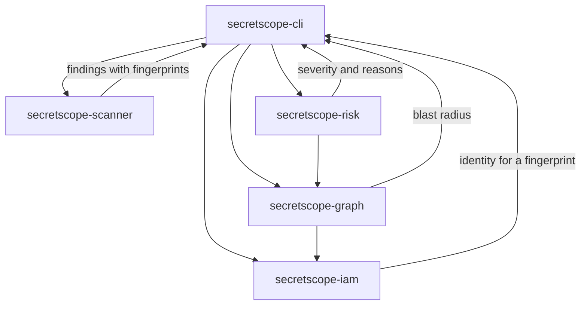
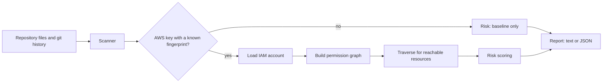
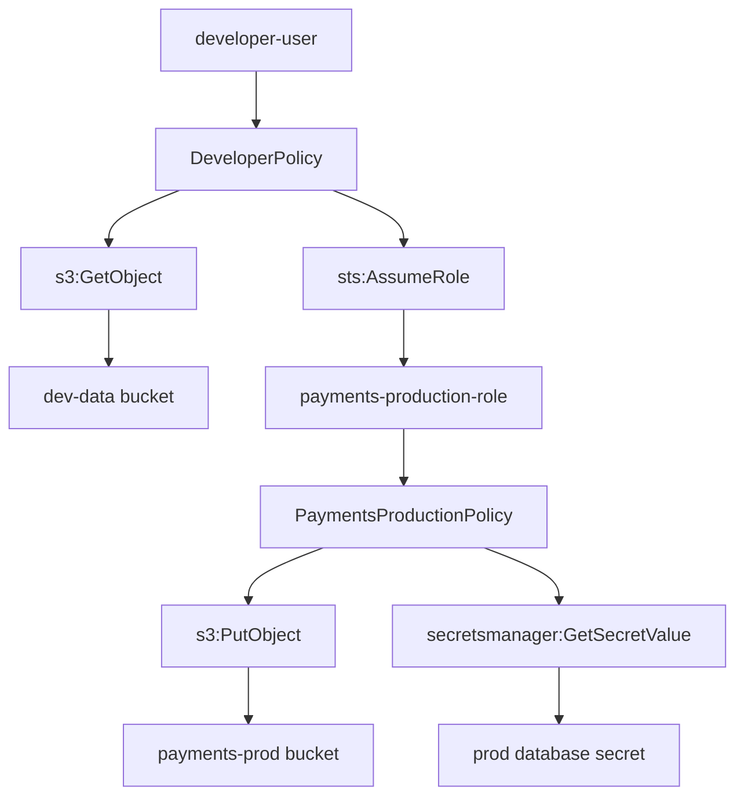
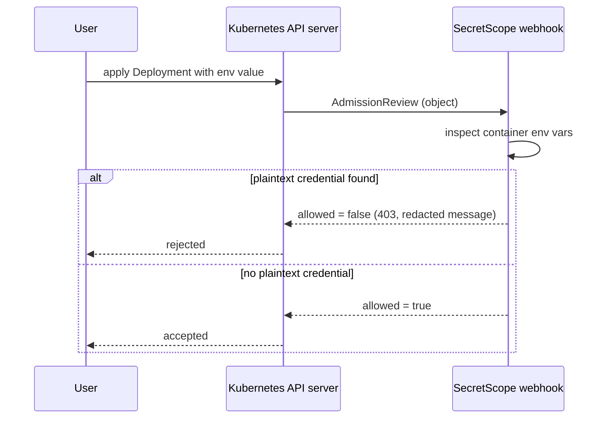
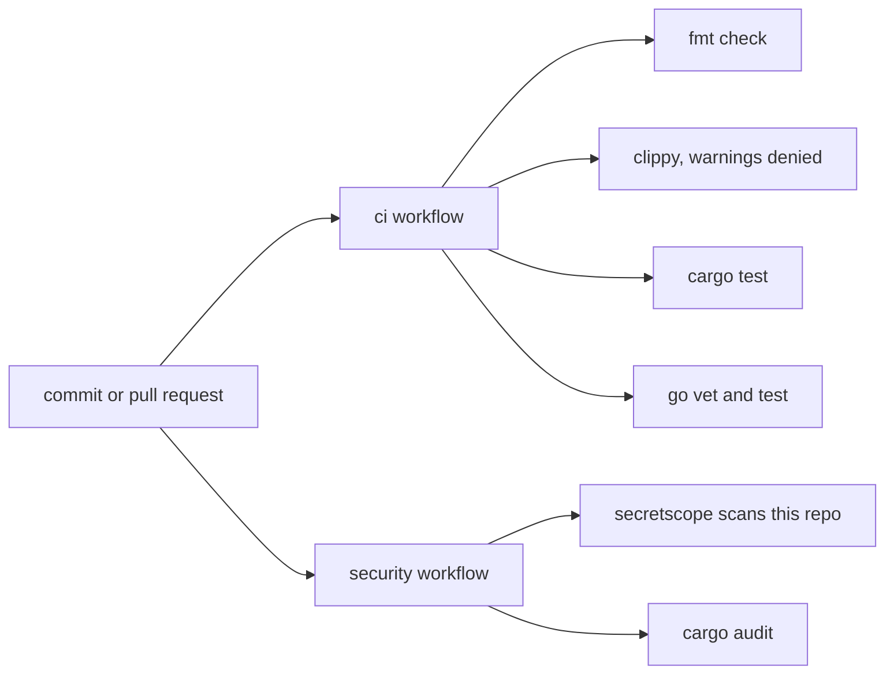

# SecretScope

SecretScope is a command line tool that does two things that usually live in
separate tools. First, it scans a repository for exposed credentials, in the
working tree and optionally in git history. Second, for any AWS credential it
finds, it works out the blast radius: which resources that credential could
reach, whether it can assume a role to reach further, and how bad that would be.

The idea started from a simple observation. A scanner that says "you leaked an
access key" is useful, but the next question is always "so what can someone
actually do with it?" Answering that means looking at the identity behind the
key and the permissions attached to it. SecretScope tries to answer both
questions in one pass.

Everything here runs locally against synthetic fixtures. There is no real AWS
account involved and nothing costs money to run.

## What it does

- Detects AWS access keys, GitHub tokens, private keys, and generic
  high-entropy secrets, using pattern matches plus an entropy check.
- Redacts every secret and stores a SHA-256 fingerprint instead of the raw
  value. The raw value is wiped from memory once the fingerprint is computed.
- Optionally walks git history to find secrets that were committed and later
  deleted, attributing each to the commit that introduced it.
- Maps a detected credential to an IAM identity by fingerprint, then builds a
  permission graph and reports the reachable resources and privilege paths.
- Scores each finding with a deterministic, explainable model that lists the
  reasons behind the severity rather than emitting a mystery number.
- Ships a small Kubernetes validating admission webhook, written in Go, that
  rejects workloads carrying plaintext credentials in environment variables.

## Architecture

The project is a Rust workspace of five library crates plus a CLI, and a
separate Go module for the webhook. Each crate has one job.



The data flow for a single scan looks like this.



## The blast radius idea

When a credential maps to an identity, SecretScope builds a graph. Principals
point to their policies, policies allow actions, actions reach resources, and an
`sts:AssumeRole` action reaches another principal. Following those edges answers
the question "what can this key touch?"



Two rules matter in the traversal. An explicit `Deny` always beats an `Allow`,
which matches how AWS evaluates permissions. And role assumption can form a
cycle, so the traversal keeps a visited set of principals and stops when it
comes back to one it has already expanded. That is why the analysis always
terminates even on a fixture where role A assumes B, B assumes C, and C assumes
A again.

## Trying it

Build the CLI and run it against the vulnerable fixture, pointing at the
matching IAM fixtures:

```
cargo build --release -p secretscope-cli
./target/release/secretscope scan fixtures/repositories/vulnerable \
  --iam-dir fixtures/aws/demo-account
```

The output below is the real result from that command:

```
SecretScope

Scanned: fixtures/repositories/vulnerable
Findings: 1

[CRITICAL] AWS Access Key
Location: config/dev.env:4
Redacted: AKIA************MPLE
Fingerprint: 1a5d44a2dca1
Identity: developer-user

Blast radius:
developer-user
\-- DeveloperPolicy
    |-- s3:GetObject
    |   \-- arn:aws:s3:::dev-data/*
    \-- sts:AssumeRole
        \-- payments-production-role
            \-- PaymentsProductionPolicy
                |-- s3:GetObject
                |   \-- arn:aws:s3:::payments-prod/*
                |-- s3:PutObject
                |   \-- arn:aws:s3:::payments-prod/*
                \-- secretsmanager:GetSecretValue
                    \-- arn:aws:secretsmanager:us-east-1:123456789012:secret:prod/database

Reachable resources: 3
Privilege paths: 1

Risk: CRITICAL (score 15)
Reasons:
- a credential was detected in the repository
- credential maps to the IAM identity developer-user
- credential can assume 1 role(s), creating a privilege path
- reachable identity can retrieve a secret value
- a production or sensitive resource is reachable
- reachable identity can write to a resource
- reachable identity can read a resource
- 3 resources are reachable in total
```

For machine consumption, add `--format json`. The JSON output carries the same
information, including a rendered path string for each reachable resource. It
never contains the raw secret; only the short fingerprint prefix appears.

Other things to try:

- `--history` walks git history. On a repository where a key was committed and
  later removed, the working tree scan reports nothing while the history scan
  finds the key and names the commit that introduced it.
- `--fail-on high` makes the process exit non-zero when a finding reaches that
  severity, which is what a CI gate would use. Exit code 0 means nothing
  reached the threshold, 1 means something did, and 2 means an error.
- Scanning the clean fixture reports no findings.

## Fixtures

The `fixtures/` directory holds synthetic inputs so the tool has something to
work on without touching real infrastructure.

- `fixtures/repositories/vulnerable` contains a documentation placeholder AWS
  key that cannot authenticate. `fixtures/repositories/clean` contains ordinary
  source with no secrets.
- `fixtures/aws/` holds several small accounts, each built to exercise one
  behavior: a read-only development identity, direct resource access with no
  role, a one hop role assumption, an explicit deny that removes a delete
  permission, and a cyclic role chain that the traversal has to survive.

The credential in the vulnerable repository is wired to the `demo-account`
identity by fingerprint, which is how the scanner result connects to the IAM
analysis.

## Risk scoring

The score is a sum of points from a fixed set of rules, and every rule that
fires adds a plain sentence explaining itself. The severity bands are: 0 to 2 is
low, 3 to 5 is medium, 6 to 9 is high, and 10 or more is critical. The rules and
their points are documented at the top of `crates/secretscope-risk/src/score.rs`.
The design goal was that a reader can look at the reasons and agree or disagree,
rather than trusting an opaque value. The same input always produces the same
output.

## The Kubernetes webhook

`k8s/admission-webhook` is a validating admission webhook written with only the
Go standard library. When a Pod or a workload with a pod template is created, it
inspects container environment variables. A variable with a plaintext value that
looks like a credential is rejected. A variable that sources its value from a
Secret through `valueFrom.secretKeyRef` is allowed, because that is the pattern
worth encouraging.



The webhook was run locally over plain HTTP for testing. A request carrying a
plaintext AWS key returned `allowed: false` with a redacted message, a request
using a `secretKeyRef` returned `allowed: true`, and the raw secret did not
appear in the response or the server logs.

The cluster demo itself, with kind and TLS, was not executed in the environment
where this project was assembled, because Docker and kind were not available
there. The manifests, the certificate script, and the Makefile targets for the
cluster demo are included and the YAML is valid, but the end to end cluster run
is the one piece that has not been exercised. The `make k8s-up`, `k8s-demo-safe`,
`k8s-demo-unsafe`, and `k8s-down` targets are provided for anyone who does have a
cluster.

## Testing

The Rust workspace has 63 tests and the Go module has 9, all passing. They cover
detection and redaction, entropy, fingerprinting, the filesystem and git walkers,
wildcard matching, permission evaluation including deny precedence, graph
traversal including the cyclic fixture, risk scoring against each severity band,
and the CLI end to end including the exit codes and a check that the raw secret
never appears in JSON output.

Run them with:

```
cargo test --workspace
cd k8s/admission-webhook && go test ./...
```

## Benchmarks

The numbers below were measured on the machine used to assemble the project, a
single core x86-64 Linux box, with a release build. They are wall-clock and will
differ on other hardware. The harness lives in `benchmarks/` and generates its
inputs from a fixed seed so runs are comparable.

Scanner throughput on generated repositories:

| dataset | files | size | mode       | mean     | files per second |
| ------- | ----- | ---- | ---------- | -------- | ---------------- |
| small   | 50    | 36K  | sequential | 1.30 ms  | 38441            |
| small   | 50    | 36K  | parallel   | 1.47 ms  | 33991            |
| medium  | 200   | 144K | sequential | 5.31 ms  | 37688            |
| medium  | 200   | 144K | parallel   | 6.21 ms  | 32208            |
| large   | 1000  | 723K | sequential | 27.59 ms | 36251            |
| large   | 1000  | 723K | parallel   | 31.43 ms | 31815            |

The parallel scanner was slightly slower than the sequential one here. That is
not a mistake, and it is worth being honest about. The benchmark machine has a
single core, so there is no second core for the parallel work to run on, and the
coordination overhead of splitting the work has nothing to overlap with. On a
multi-core machine the parallel path is expected to help. The sequential path is
kept as the baseline and for reproducible comparisons.

IAM loading and blast radius:

| operation                    | result                                      |
| ---------------------------- | ------------------------------------------- |
| load the demo account        | mean 15.75 us, about 63000 loads per second |
| blast radius, chain depth 5  | mean 47 us                                  |
| blast radius, chain depth 20 | mean 408 us                                 |
| blast radius, chain depth 50 | mean 1984 us                                |

The blast radius time grows faster than linearly with the length of the role
chain. That comes from the assembly step, which scans the node set once per
reachable resource to collect its actions. For the account sizes this tool
targets it is not a problem, but it is the obvious place to optimize if the
graphs ever got large.

## Delivery



The `ci` workflow formats, lints with warnings denied, tests, and builds both
the Rust workspace and the Go module. The `security` workflow builds the CLI and
runs SecretScope against this repository, excluding the directories that hold
synthetic test credentials, and fails if anything else looks like a secret. A
separate benchmark workflow runs on demand.

Note on the self-scan: the fixtures, test directories, and example manifests
intentionally contain synthetic credentials so the tool has something to detect,
so they are excluded from the self-scan. Everything else is scanned and must stay
clean. The application source itself contains no literal secrets. The settings
for this live in `.secretscope.toml`.

## Choices worth explaining

A few decisions were deliberate and are worth naming.

- Git history scanning shells out to the installed `git` binary rather than
  linking a git library. This keeps the dependency surface small and means the
  history walk behaves exactly like the git a developer already has.
- The permission graph is written by hand rather than pulled from a graph
  library. The operations needed here are a build, a breadth-first traversal,
  and a path reconstruction, which are short enough that a dependency would add
  more surface than clarity.
- The benchmark harness is custom rather than a standard framework. The usual
  choice pulls in a dependency tree that requires a newer Rust edition than the
  1.75 baseline this project targets, so the harness does the essential parts,
  repeated runs with mean, minimum, and standard deviation, by hand.
- The webhook uses only the Go standard library. The Kubernetes client modules
  are large, and defining the small slice of the admission and pod schema that
  the webhook actually needs keeps the module dependency free and easy to read.

## Limitations

This is a learning project, and the scope is bounded on purpose.

- The IAM model is a small subset of AWS. It covers users, roles, managed
  policies referenced by name, allow and deny statements, actions, resources,
  and `sts:AssumeRole`. It does not model conditions, permission boundaries,
  service control policies, session policies, resource-based policies, or cross
  account trust. Real AWS authorization is considerably more involved.
- The action vocabulary the analyzer reasons about is intentionally small, so
  blast radius enumeration stays bounded and predictable.
- Detection uses patterns and entropy. It will miss credential formats it does
  not know about, and like any entropy-based approach it can be fooled in both
  directions. The generic detector only considers values that look like opaque
  tokens, which reduces false positives on ordinary code but is a heuristic.
- The cluster demo has not been run end to end here, as described in the
  webhook section.

## What I learned

The part that taught me the most was the permission graph. Getting role
assumption right, and in particular making cycles terminate cleanly while still
reporting the resource at the end of the chain, took a few tries before the
model felt simple. Writing the risk score as a set of explained rules rather
than a single formula also changed how I thought about the output: once every
point had to justify itself in a sentence, the scoring got easier to reason
about and easier to test. Finally, keeping raw secrets out of every output path,
and proving it with a test, was a good reminder that a security tool has to be
careful about the very thing it is looking for.

## License

MIT. See `LICENSE`.
